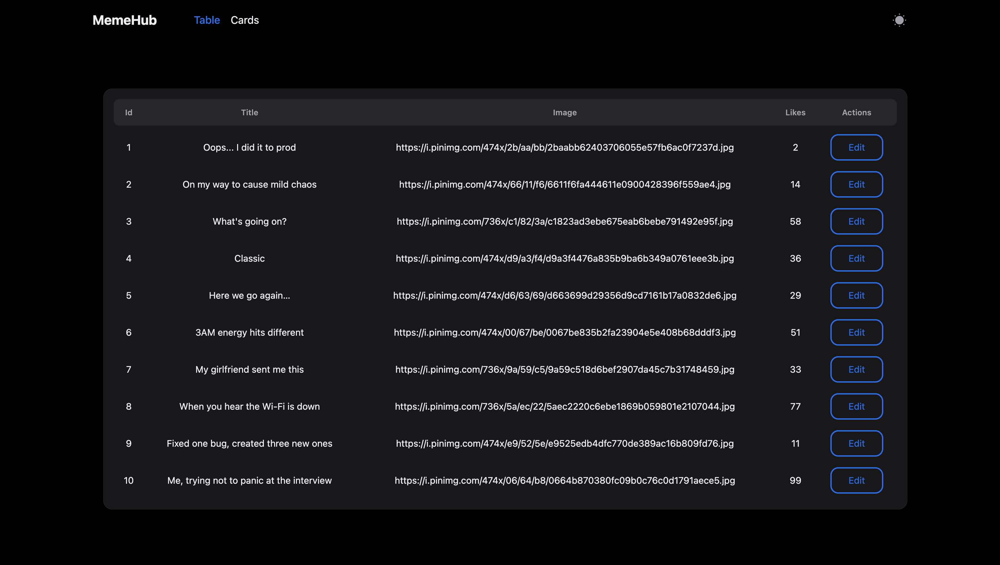

### 🧠 HeroUI MemeHub

 

A full-stack application for creating and browsing memes.  
Frontend built with **React + Vite + HeroUI**, backend powered by **Node.js + Express + TypeScript**.

### 🔗 Live Demo

🌐 [View the project online](https://herouimemehub-production-c51a.up.railway.app)

---

## 📁 Project Structure

```
├── frontend      # Frontend (React + Vite)
├── backend      # Backend (Node.js + Express)
├── README.md
```

---

## 🚀 Getting Started Locally

### 🔧 Requirements

- Node.js (recommended version 18+)
- npm or yarn

---

### 1. Clone the Repository

```bash
git clone https://github.com/artemtyshchuk/HeroUI_MemeHub.git
cd HeroUI_MemeHub
```

---

### 2. Install Dependencies

#### 📦 Frontend

```bash
cd frontend
npm install
```

#### 🖥️ Backend

```bash
cd backend
npm install
```

---

### 3. Run in Development Mode

#### 🔥 Frontend (default port: 5173)

```bash
cd frontend
npm run dev
```

#### ⚙️ Backend (default port: 3000)

```bash
cd backend
npm run dev
```

---

### 4. Build for Production

#### Frontend:

```bash
cd frontend
npm run build
```

#### Backend:

```bash
cd backend
npm run build
```

---

### 5. Start Production Server

#### Backend:

```bash
cd backend
npm start
```

#### Frontend (served with Vite Preview):

```bash
cd frontend
npm run preview
```

---

### 🧪 Additional Scripts

#### Frontend:

- `npm run lint` — Run ESLint with auto-fix
